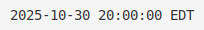
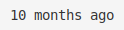

# No UTC - Time Conversion Service

Convert UTC timestamps to local time as SVG images.

## Demo

### Absolute Time (with timezone)


### Relative Time ("X ago")


### Custom Format


### Long Format


## Usage

Access the API endpoint:

```
/api/t.svg?t=<timestamp>&f=<format>&relative=<true|false>&bg=<color>&fg=<color>
```

### Examples

**Absolute time with timezone:**
```
https://noutc.vercel.app/api/t.svg?t=2025-10-31T00:00:00Z&f=yyyy-MM-dd%20HH:mm:ss%20zzz
```

**Relative time:**
```
https://noutc.vercel.app/api/t.svg?t=2025-01-01T00:00:00Z&relative=true
```

**Custom format:**
```
https://noutc.vercel.app/api/t.svg?t=2025-12-25T15:30:00Z&f=MMMM%20dd,%20yyyy%20HH:mm%20zzz
```

### Parameters

- **t** (required): ISO 8601 timestamp
- **f** (optional): Date format string (default: yyyy-MM-dd HH:mm:ss zzz)
- **relative** (optional): Set to `true` for relative time format (e.g., "5 minutes ago")
- **bg** (optional): Background color (default: white)
- **fg** (optional): Foreground/text color (default: black)

### Format Patterns

Common patterns (case-sensitive):
- `yyyy` - 4-digit year
- `MM` - 2-digit month (01-12)
- `dd` - 2-digit day (01-31)
- `HH` - 2-digit hour, 24-hour format (00-23)
- `mm` - 2-digit minute (00-59)
- `ss` - 2-digit second (00-59)
- `zzz` - timezone abbreviation (e.g., EDT, PST)
- `MMMM` - full month name (e.g., January)
- `EEEE` - full day name (e.g., Monday)

Legacy patterns (automatically converted):
- `YYYY` - converted to `yyyy`
- `DD` - converted to `dd`
- `hh` - converted to `HH`
- `sss` - converted to `ss`
- `TZ` - converted to `zzz`

## Features

- Automatically detects user's timezone from HTTP request headers
- Converts UTC timestamps to local time
- Returns formatted time as SVG image
- Supports custom date format strings
- **NEW:** Relative time format (e.g., "5 minutes ago", "2 hours ago")
- Built with Next.js and date-fns

## Development

```bash
# Install dependencies
bun install

# Run development server
bun run dev

# Build for production
bun run build
```

## Deployment

Deploy to Vercel:

```bash
vercel
```

The service will automatically detect user timezones from the following headers:
- `x-timezone`
- `timezone`
- `cf-timezone` (Cloudflare)

If no timezone header is found, defaults to UTC.
